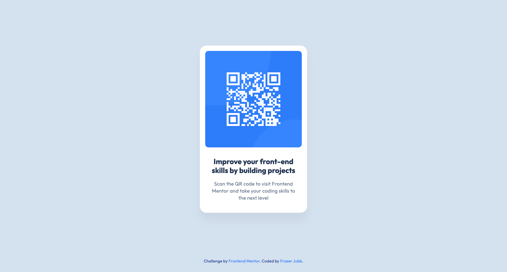

# Frontend Mentor - QR code component solution - Fraser Jubb

This is a solution to the [QR code component challenge on Frontend Mentor](https://www.frontendmentor.io/challenges/qr-code-component-iux_sIO_H).

## Table of contents

- [Overview](#overview)
  - [Project Screenshot](#project-screenshot)
  - [Project Links](#project-links)
- [My process](#my-process)
  - [Built with](#built-with)
  - [What I learned](#what-i-learned)
  - [Continued development](#continued-development)
  - [Useful resources](#useful-resources)
- [Where to find me](#where-to-find-me)

## Overview

### Project Screenshot



### Project Links

- Solution URL: [Add solution URL here](https://your-solution-url.com)
- Live Site URL: [Click Here](https://fm-qrcodecomponent-fraser.netlify.app/){:target="\_blank"}

## My process

### Built with

- HTML
- CSS
- Desktop-first workflow

### What I learned

It felt good finally creating something that was _not_ from a tutorial.

In this particular project:

1. I wanted to add the focus/challenge of using CSS variables as I had never used them before up until this point. Even though they are a little redundant on a smaller project, this felt like a great opportunity to learn it. I now have a much better understanding of how they work and can see their use on larger projects.

```css
:root {
  /* Colors: */
  --white: #fff;
  --slate-300: #d5e1ef;
  --slate-400: #94a3b8;
  --slate-500: #68778d;
  --slate-900: #1f314f;
  --blue-500: #3685ff;
  --blue-600: #2c7dfa;
  --blue-700: #1d4ed8;
  --blue-900: #1e3a8a;

  /* Font Size: */
  --fs-h2: 2.2rem;
  --fs-p-normal: 1.5rem;
  --fs-p-small: 1.2rem;

  /* Font Weight: */
  --fw-normal: 400;
  --fw-bold: 700;

  /* Line Height: */
  --lh-h2: 1.2;
  --lh-p: 1.4;

  /* Letter Spacing: */
  --ls-small: 0.2px;

  /* Spacing: */
  --space-40: 40px;
  --space-24: 24px;
  --space-16: 16px;
}
```

2. This was my first project that involved using a Figma file for reference. It was a little overwhelming at first but I have managed to grasp the basics.

3. In the brief for this project, I learned about the screenshot tool, FireShot. A simple tool that can create screenshots of entire webpages with ease. Might consider getting the Pro version in the future.

4. Finally, this is also my first proper README file and having a proper look at Markdown syntax.

### Continued development

After submitting this project, I wish to develop the following:

1. Figure out a naming convention style that works best for me, particularly for CSS variables.

2. Increase my understanding of Figma, particularly navigation. This will likely come through further practice in future projects.

### Useful resources

- [Tailwind CSS Colors](https://tailwindcss.com/docs/customizing-colors) - After referencing the Figma file, I figured out that the colors were named/created using Tailwind CSS. Finding this then helped me for identifying additional colors to use (mainly in the footer).
- [CSS Variables Tutorial - YouTube](https://www.youtube.com/watch?v=oZPR_78wCnY) - I am someone who learns better through video tutorials. This is a fantastic and concise video which helped me get straight into making my own variables. I'd recommend this channel to anyone learning Web Development.

## Where to find me

_Note: In the coming weeks/months ahead, I plan to update this README file - particularly the Author section below as I get better links to share to connect with others._

- Frontend Mentor - [@fraserjubb](https://www.frontendmentor.io/profile/fraserjubb)
- GitHub - [@fraserjubb](https://github.com/fraserjubb)
- Twitter - [@fraserjubb](https://www.twitter.com/fraserjubb)
- Instagram - [@thejubbzone](https://www.instagram.com/thejubbzone/) - this is where I post 3D art and video game development progress.
